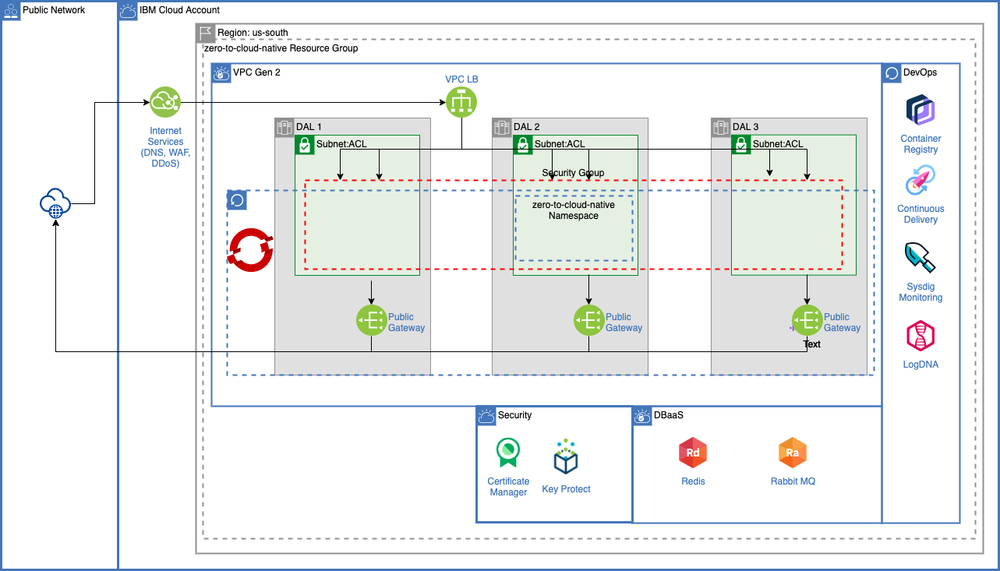

# ZERO to Cloud-Native on IBM Cloud

With over 200 services available in IBM Cloud Catalog you can develop virtual any cloud native application that you can dream of.  But how can you best get started.  The purpose of this blog series ‘Zero to Cloud-Native with IBM Cloud’ is to showcase how to get started in developing with the IBM Cloud Catalog.  This multi-part series will cover topics such as architecture design and how to select the best services available in the IBM Cloud Catalog based on your architecture and application, how to combine services together and then how to implement day two operations while you are developing and also after you have deployed your application.

## Tutorial Oveview
The best what to learn from my perspective is getting hands on experience.  The accompanying tutorial will go through the entire cloud-native development lifecycle.   I will walk through step by step to create an entire cloud native application on IBM Cloud leveraging the IBM Cloud Catalog.   

The tutorials will go through the following topics:  

* Microservices design  
* Creating a new isolated resource group
* Creating a custom domain for your application.  
* Setting up and configuring a virtual private cloud including configuring subnets, access control lists and security groups.  
* Configuration of IBM Cloud Internet Services to secure and provide DNS services for a custom domain  
* Leveraging certificate manager to create and managed domain certificates  
* Using Key Protect to manage your own certificates across IBM Cloud services  
* Provisioning and configuring a managed OpenShift Cluster in a multi-zone region  
* Provisioning and configuring Rabbit MQ for messaging  
* Provisioning and configuring IBM Cloud Databases for a data layer  
* Creating a classic CI/CD pipeline with integration with an enterprise git repository  
* Creating a tekton CI/CD pipeline with integration with an enterprise git repository  
* Deploying and running the application on OpenShift  
* Leveraging IBM Log Analysis with LogDNA to provide logging and troubleshoot both from a development and support perspective.  
* Leveraging IBM Systems Monitoring with SysDig to monitor IBM Cloud Platform components, OpenShift cluster and the application itself.  
* Tuning your cluster to optimize availability and resources.  
* New functionality from IBM Cloud to clone and re-instate cluster namespaces  

## ZERO to Cloud Native on IBM Cloud Application
The tutorial application will comprise of three APIs:  
1)	**getOCPVersions** – will return a list of OpenShift versions supported by IBM Cloud Managed OpenShift  
2)	**getOCPToken** – will return an OCP token to login into your cluster.  
3)	**enableNodeSSH** – will enable your IBM Cloud Managed OpenShift worker nodes to be SSH’d into.  

To support these APIs, the following microservices, all written in Python, will be created.
  
* **frontend-web.py** – HTML front end to invoke the three public facing APIs  
* **frontend-api.py** – API interface to call the public facing APIs   
* **getOCPVersions.py** – implementation of the getOCPVersions API which will quickly return a list of APIs leveraging a Redis Cache.  
* **loadOCPVersions.py** – Kubernetes cronjob that will load current versions of OCP supported by IBM Cloud into a Redis database.   
* **getOCPToken.py** – implementation of the real-time getOCPToken API.  
* **enableNodeSSH.py** – implementation of the ‘long’ running enableNodeSSH API

## ZERO to Cloud Native Index
[Part 1 - Introduction and Overview ](docs/zero-to-cloud-native-part1-introduction.pdf)  
[Part 2 - Microservices Architecture and Design ](docs/zero-to-cloud-native-part2-microservices-design.pdf)  
[Part 3 - Network and Security Configuration ](docs/zero-to-cloud-native-part3-network-and-security-configuration.pdf)  
[Part 4 - RedHat OpenShift on IBM Cloud Setup and Configuration ](docs/zero-to-cloud-native-part4-openshift.pdf)  
[Part 5 - IBM Cloud Databases and Messaging ](docs/zero-to-cloud-native-part5-cloud-databases-and-messaging.pdf)

